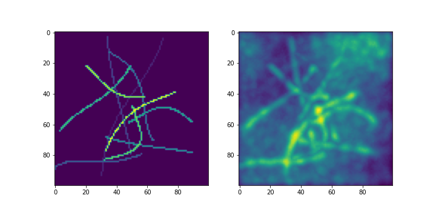

# CS-Sim: synthetic images with curvilinear structures

Package for generating synthetic images with curvilinear structures, and corrupting them with noise, background, and
blur.

The images are intended to be used as ground truth for filament- and curvilinear-structure-detection methods.



## Installation

```angular2html
pip install git+https://github.com/amedyukhina/CS-Sim.git
```

## Usage

See the [demo notebook](demo.ipynb) for details.

### Generate synthetic image

```
from cs_sim.synth.filaments import generate_img_with_filaments

img = generate_img_with_filaments(imgshape=(20, 100, 100), n_filaments=10, maxval=255)
```

### Corrupt image with noise, blur and background

#### Specify corruption steps

There are 4 steps that can be combined in any order:

1. Perlin noise: adds low-frequency background. The `size` parameter specifies the size of the low-frequency pattern (in
   pixels), the `value` parameter specifies the amplitude.
2. Convolve: convolves the image with either a specified PSF image (`psf` parameter), or with a gaussian kernel of
   specified `sigma`.
3. Poisson noise, with specified `snr`.
4. Gaussian noise, with specified `snr`.

```

corruption_steps = [
    ('perlin_noise', {'size': 50, 'value': 0.1}),
    ('poisson_noise', {'snr': 2}),
    ('convolve', {'sigma': 2}),
    ('gaussian_noise', {'snr': 100})
]
```

#### Corrupt the image

```angular2html
from cs_sim.corrupt import corrupt_image

img_corr = corrupt_image(img, corruption_steps)
```

### Save parameters to a json file for batch processing

```angular2html
import json

params_synth_data = dict(
    imgshape=(20, 100, 100),
    n_filaments=10,
    maxval=255,
    nval=100
)

with open('parameters_synth_data.json', 'w') as f:
    json.dump(params_synth_data, f, indent=4)

corruption_steps = [
    ('perlin_noise', {'size': 50, 'value': 0.1}),
    ('poisson_noise', {'snr': 2}),
    ('convolve', {'sigma': 2}),
    ('gaussian_noise', {'snr': 100})
]

with open('corruption_steps.json', 'w') as f:
    json.dump(corruption_steps, f, indent=4)
```

### Batch processing

#### Generating synthetic images

```angular2html
from cs_sim.batch.batch_synth import batch_generate_img_with_filaments

with open('parameters_synth_data.json') as f:
    params = json.load(f)
batch_generate_img_with_filaments(n_img=10, n_jobs=10, dir_out='test_input', **params)
```

#### Corrupting the images

```angular2html
from cs_sim.batch.batch_corrupt import batch_corrupt_image

with open('corruption_steps.json') as f:
    corr_steps = json.load(f)
batch_corrupt_image('test_input', 'test_output', corr_steps, n_jobs=10)
```

#### Using the scripts

```angular2html
python scripts/batch_generate_img_with_filaments.py -p parameters_synth_data.json -o test_input -n 10
```

```angular2html
python scripts/batch_corrupt_images.py -p corruption_steps.json -i test_input -o test_output
```
